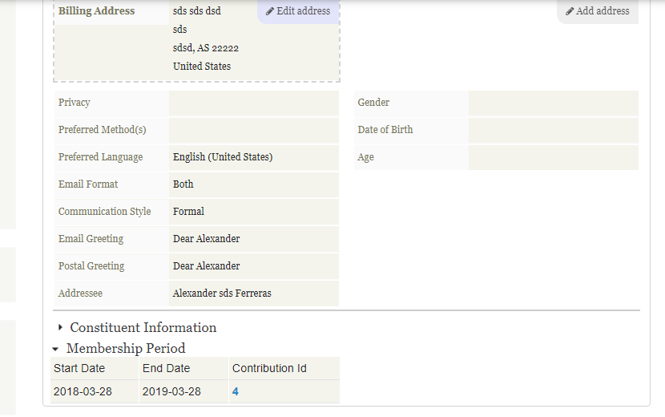

# com.ferreras.membershipperiod



(*When you renew a memebership this ext follow all renew date of members  in /civicrm/contact/view?reset=*)

The extension is licensed under [AGPL-3.0](LICENSE.txt).

## Requirements

* PHP v5.4+
* CiviCRM (*FIXME: Version number*)

## Installation (Web UI)

This extension has not yet been published for installation via the web UI.

## Installation (CLI, Zip)

Sysadmins and developers may download the `.zip` file for this extension and
install it with the command-line tool [cv](https://github.com/civicrm/cv).

```bash
cd <extension-dir>
cv dl com.ferreras.membershipperiod@https://github.com/alexander0205/com.ferreras.membershipperiod/archive/master.zip
```

## Installation (CLI, Git)

Sysadmins and developers may clone the [Git](https://en.wikipedia.org/wiki/Git) repo for this extension and
install it with the command-line tool [cv](https://github.com/civicrm/cv).

```bash
git clone https://github.com/alexander0205/com.ferreras.membershipperiod.git
cv en membershipperiod
```

## Usage

(* FIXME: Where would a new user navigate to get started? What changes would they see? *)

## Known Issues

(* FIXME *)
